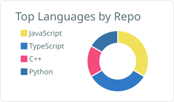
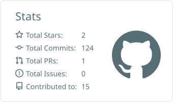

<h1 align="center">Hi, I'm Nabil Hasan Jami</h1>

<p align="center">
  <a href="https://git.io/typing-svg">
    
  </a>
</p>

<!-- Anime / Cyberpunk Banner -->

<p align="center">
  
</p>

## About Me

* CSE student at the University of Dhaka
* Interested in AI agents, cybersecurity, backend systems and automation
* CTF player and builder of security-focused AI tools
* Exploring Forward Deployed Engineering
* Currently building projects instead of just collecting tutorials

<br>

## Boot.dev

<p align="center">
  
</p>

<br>

## GitHub Stats

<p align="center">
  <picture>
    <source media="(prefers-color-scheme: dark)" srcset="./profile-summary-card-output/github_dark/1-repos-per-language.svg">
    <source media="(prefers-color-scheme: light)" srcset="./profile-summary-card-output/default/1-repos-per-language.svg">
    
  </picture>
</p>

<p align="center">
  <picture>
    <source media="(prefers-color-scheme: dark)" srcset="./profile-summary-card-output/github_dark/3-stats.svg">
    <source media="(prefers-color-scheme: light)" srcset="./profile-summary-card-output/default/3-stats.svg">
    
  </picture>
</p>

<p align="center">
  
</p>

<br>

## Most Used Languages

<p align="center">
  <picture>
    <source media="(prefers-color-scheme: dark)" srcset="./profile-summary-card-output/github_dark/1-repos-per-language.svg">
    <source media="(prefers-color-scheme: light)" srcset="./profile-summary-card-output/default/1-repos-per-language.svg">
    
  </picture>
</p>

<br>

## Contribution Snake

<p align="center">
  <picture>
    <source media="(prefers-color-scheme: dark)" srcset="https://raw.githubusercontent.com/NabilxHasan/NabilxHasan/output/github-contribution-grid-snake-dark.svg">
    <source media="(prefers-color-scheme: light)" srcset="https://raw.githubusercontent.com/NabilxHasan/NabilxHasan/output/github-contribution-grid-snake.svg">
    
  </picture>
</p>

<br>

## Tech Stack

<p align="center">


</p>

<br>

## Currently Building

```text
AI Agents       ███████████████████░░
Cybersecurity   ██████████████████░░░
Backend         ████████████████░░░░░
Systems         ███████████████░░░░░░
GameDev         ████████████░░░░░░░░░
```

<br>

## Featured Projects

<p align="center">

<a href="https://github.com/NabilxHasan/fieldline">
  
</a>

</p>

<br>

<p align="center">
  <i>「 The best way to predict the future is to build it. 」</i>
</p>

<p align="center">
  
</p>
